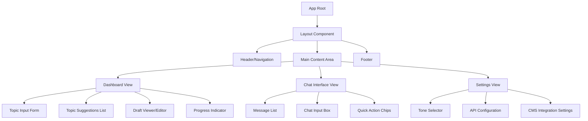

# Component 1: User Interface (UI) - Implementation Design

## Overview

This document outlines the implementation design for the User Interface component of the Blog Writing Agent. As the Solution Architect, I've analyzed the requirements and designed a comprehensive UI structure that ensures logical flow and coherence across all user interactions.

## Architecture

### Technology Stack

- **Frontend Framework**: React with TypeScript for type safety and component reusability
- **State Management**: Redux Toolkit for managing application state
- **Styling**: TailwindCSS for rapid, consistent UI development
- **API Communication**: Axios with interceptors for API calls to the backend
- **Routing**: React Router for navigation between views

### Component Structure



## Key Components

### 1. Dashboard View

**Purpose**: Primary interface for generating and managing blog content.

**Sub-components**:

- **Topic Input Form**
  - Input field for keywords/topics
  - Tone selector dropdown (Professional, Casual, Witty, Persuasive)
  - "Generate Ideas" button
  - Character counter and validation

- **Topic Suggestions List**
  - Card-based display of generated topics
  - Each card shows: title, description, estimated word count
  - "Select" button on each card
  - Ability to regenerate specific topics

- **Draft Viewer/Editor**
  - Rich text editor for viewing and editing drafts
  - Split view: outline on left, content on right
  - Inline revision request capability
  - SEO score indicator
  - Meta title/description preview

- **Progress Indicator**
  - Step-by-step progress visualization
  - Current stage indicator (Research → Outline → Draft → Review → Optimize)
  - Estimated time remaining

### 2. Chat Interface View

**Purpose**: Conversational interface for iterative content refinement.

**Sub-components**:

- **Message List**
  - Scrollable chat history
  - User messages (right-aligned)
  - Agent responses (left-aligned)
  - Markdown rendering for formatted content
  - Code block support for examples

- **Chat Input Box**
  - Multi-line text input
  - Send button with keyboard shortcut (Ctrl+Enter)
  - File attachment capability (for reference materials)
  - Voice input option (future enhancement)

- **Quick Action Chips**
  - Pre-defined prompts: "Make it more engaging", "Simplify language", "Add examples"
  - Context-aware suggestions based on current draft stage

### 3. Settings View

**Purpose**: Configuration and preferences management.

**Sub-components**:

- **Tone Selector**
  - Default tone preference
  - Custom tone creation (advanced)

- **API Configuration**
  - API key management
  - Model selection (if applicable)
  - Rate limit monitoring

- **CMS Integration Settings**
  - WordPress, Medium, Ghost connection configuration
  - Default publishing settings
  - Auto-publish toggle

## User Flows

### Flow 1: Generate a Blog Post (Dashboard)

1. User lands on Dashboard
2. User enters a keyword/topic in the input form
3. User selects desired tone
4. User clicks "Generate Ideas" (Stateless API call)
5. Topic suggestions appear as cards
6. User selects a topic -> **System starts a new Workflow**
7. UI polls for Workflow state (State: `Researching` -> `Outlining`)
8. Outline appears when state reaches `WaitingApproval`
9. User reviews outline, edits if needed, and clicks "Approve"
10. System transitions to `Drafting` state
11. UI polls until state becomes `Review`
12. Draft appears in editor with SEO score
13. User reviews, makes inline edits, or requests AI revisions
14. User publishes or saves draft

### Flow 2: Refine Content (Chat Interface)

1. User switches to Chat Interface
2. Current **Workflow Context** is loaded
3. User types a revision request: "Make the introduction more compelling"
4. Agent processes request within the workflow context
5. Updated section is highlighted in the chat or editor
6. User can continue iterating or switch back to Dashboard

### Flow 3: Configure CMS Integration (Settings)

1. User navigates to Settings → CMS Integration
2. User selects platform (e.g., WordPress)
3. User enters site URL and API credentials
4. System validates connection
5. User sets default publishing options
6. Settings are saved

## Data Models

### Workflow (New)

```typescript
interface Workflow {
  id: string;
  topicId: string;
  state: 'Researching' | 'Outlining' | 'WaitingApproval' | 'Drafting' | 'Review' | 'Optimizing' | 'Completed';
  currentStep: string; // Human readable status
  data: {
    research?: ResearchData;
    outline?: Section[];
    draft?: Draft;
  };
  createdAt: Date;
  updatedAt: Date;
}
```

### Topic Suggestion

```typescript
interface TopicSuggestion {
  id: string;
  title: string;
  description: string;
  estimatedWordCount: number;
  keywords: string[];
  tone: 'professional' | 'casual' | 'witty' | 'persuasive';
}
```

### Draft

```typescript
interface Draft {
  id: string;
  workflowId: string; // Linked to Workflow
  content: string;
  metaTitle: string;
  metaDescription: string;
  seoScore: number;
  lastUpdated: Date;
}

interface Section {
  id: string;
  heading: string;
  subheadings: string[];
  order: number;
}
```

### User Settings

```typescript
interface UserSettings {
  defaultTone: string;
  apiKey: string;
  cmsIntegrations: CMSIntegration[];
}

interface CMSIntegration {
  platform: 'wordpress' | 'medium' | 'ghost';
  siteUrl: string;
  credentials: Record<string, string>;
  autoPublish: boolean;
}
```

## API Integration Points

### Endpoints Required (Workflow-Centric)

- `POST /api/topics/generate` - Generate topic ideas (Stateless)
- `POST /api/workflows` - Start a new blog generation workflow
- `GET /api/workflows/:id` - Get current workflow state (Polling)
- `POST /api/workflows/:id/approve-outline` - Approve outline and trigger drafting
- `POST /api/workflows/:id/reject-outline` - Reject outline and trigger regeneration
- `POST /api/workflows/:id/revise` - Request revisions on the draft
- `POST /api/workflows/:id/chat` - Chat with the agent about the current context
- `POST /api/publish/:platform` - Publish to CMS

## Non-Functional Considerations

### Performance

- **Lazy Loading**: Load dashboard components on demand
- **Optimistic Updates**: Show immediate feedback while API calls are processing
- **Debouncing**: Debounce input fields to reduce unnecessary API calls
- **Caching**: Cache topic suggestions and drafts locally

### Accessibility

- **Keyboard Navigation**: Full keyboard support for all interactions
- **Screen Reader Support**: Proper ARIA labels and semantic HTML
- **Color Contrast**: WCAG AA compliant color schemes
- **Focus Management**: Clear focus indicators

### Responsive Design

- **Mobile-First**: Design for mobile screens first, then scale up
- **Breakpoints**: Support for phone, tablet, desktop, and ultra-wide screens
- **Touch Optimization**: Touch-friendly buttons and controls on mobile

## Implementation Phases

### Phase 1: Core Dashboard (MVP)

- Topic input form
- Topic suggestions display
- Basic draft viewer
- Progress indicator

### Phase 2: Advanced Editing

- Rich text editor integration
- Inline revision requests
- SEO score display

### Phase 3: Chat Interface

- Conversational UI
- Contextual message history
- Quick action chips

### Phase 4: Settings & Integration

- Settings management
- CMS integrations
- User preferences

## Testing Strategy

### Unit Tests

- Component rendering tests
- Form validation logic
- State management reducers

### Integration Tests

- API call mocking and response handling
- User flow simulations
- Cross-component communication

### E2E Tests

- Complete user journeys (Cypress)
- Multi-device testing
- Performance benchmarking
